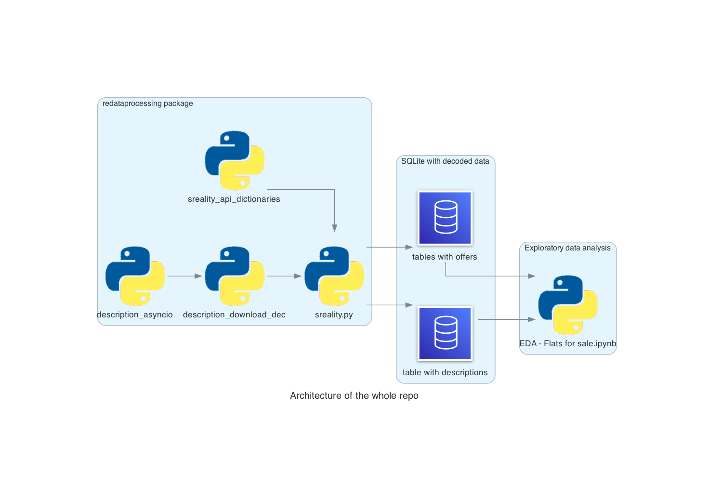

# Real Estate Data Processing - Project for Data Processing in Python (JEM207)
### Vojtěch Kania, Lukáš Novotný

## Project summary

This project aims to automate scraping data from [sreality](https://www.sreality.cz/) using its public [API](https://www.sreality.cz/api/cs/v2/estates?). For this purpose, package for requesting API, decoding requests and storing into SQLite database was uploaded on PYPI. Furthermore, exploratory data analysis was performed on data obtained by this package.

## Where to find the package
The source code is currently hosted on GitHub at:
https://github.com/vojtechkaniaedu/re_data_processing/redadataprocessing

**Detailed information on this package could be found on this site in [README.md file](https://github.com/vojtechkaniaedu/re_data_processing/tree/main/redataprocessing#readme)**

Binary installers for the latest released version are available at the [Python
Package Index (PyPI)](https://pypi.org/project/redataprocessing).

```sh
# PyPI
pip install redataprocessing
```

## Where to find the package
Moreover, we have created an exemplary EDA which we performed on flats for sale category. Can be found in EDA - flats for sale file using SQLite containing the data also uploaded on the main branch. Data were downloaded using our source code. The EDA was done before the last version of package was finished. The purpose of the EDA notebook is to show users an example how to process this kind of data. Nevertheless, the EDA would differ for different categories (different columns) as well as for different data (different outliers/misisng values treatment).

## Structure of the whole repo

