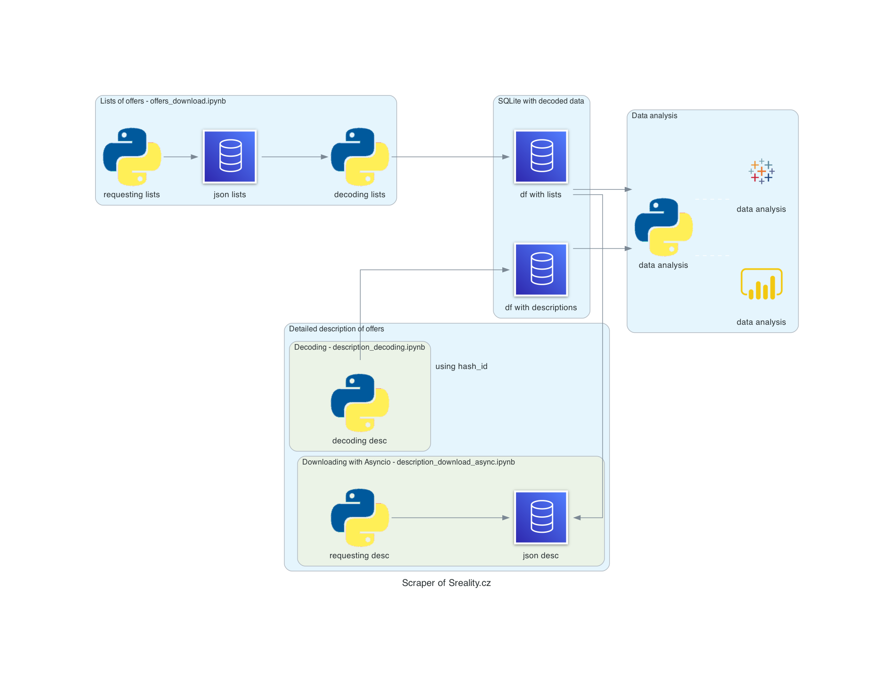

# Real Estate Data Processing
## Project for Data Processing in Python (JEM207)
## Vojtěch Kania, Lukáš Novotný

Example of databases:

| hash_id   | location | location | json request |
| ------------- | ------------- | ------------- | ------------- |
|  67812349 | Content Cell  |
| 67812349  | Content Cell  |